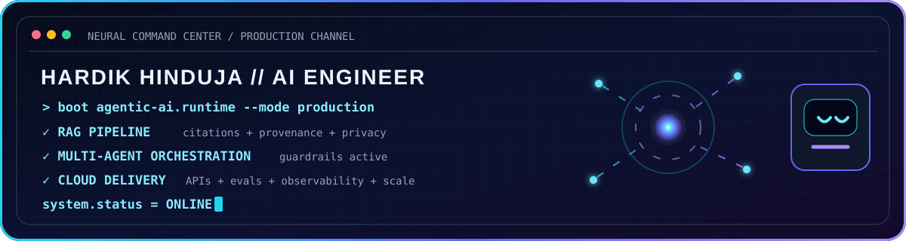
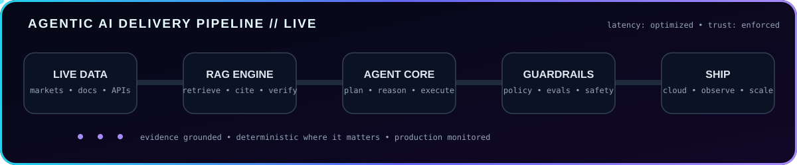
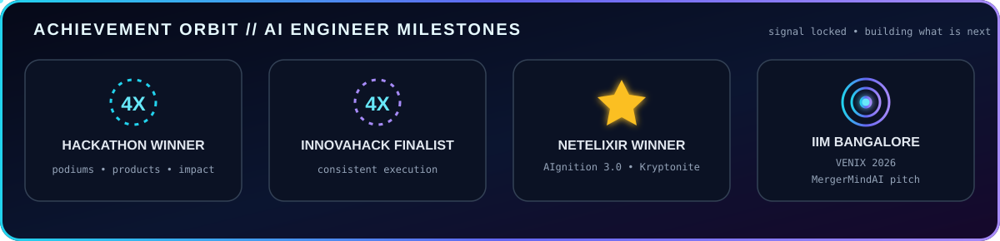
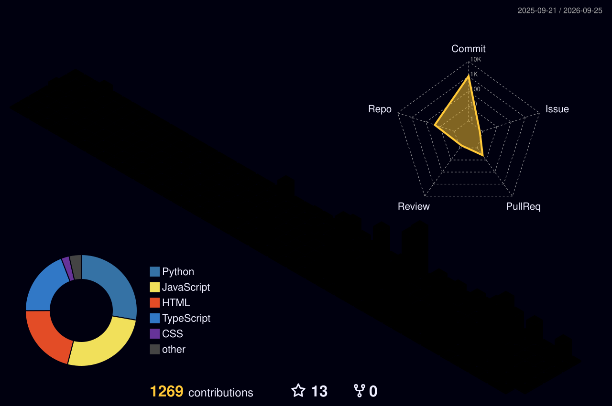

<div align="center">


<br/>




<p>
  <a href="https://www.linkedin.com/in/hardik-hinduja-1a5358216/"></a>
  <a href="https://github.com/Hardik182005?tab=repositories"></a>
  
</p>

### I engineer evidence-grounded AI products — from idea and architecture to tested, deployed systems.

</div>

## About me

I am **Hardik Hinduja**, an AI engineer and builder focused on **agentic systems, retrieval-augmented generation, applied machine learning, document intelligence, FinTech, HealthTech, and production cloud delivery**.

My projects are designed around a simple principle: **the model may explain, but critical facts, money, permissions, and safety decisions must remain verifiable**. I enjoy turning ambitious hackathon ideas into working products with real APIs, tests, observability, and live deployments.

- 🏆 **4× hackathon winner / podium finalist**
- 🥇 **NetElixir AIgnition 3.0 Winner** — Team Kryptonite
- 🥈 **Anakin Build-a-thon — 2nd Place** with ZeroOne
- 🥉 **KLEOS 4.0 — Second Runner-Up** with GigFolio
- 🚀 **4× InnovaHack Finalist**
- 🎤 Presented **MergerMindAI**, an M&A due-diligence platform, at **IIM Bangalore during VENIX 2026**
- 🎓 AI & Data Science student at **VESIT**, Mumbai

## AI systems online

<div align="center">



</div>

## Flagship builds

| Project | What it does | Engineering focus |
|---|---|---|
| [**MergerMindAI**](https://github.com/Hardik182005/M-A-major-project) | Secure, local-first M&A data room and AI due-diligence auditor pitched at IIM Bangalore | Local LLMs, RAG, citations, FastAPI, React, PostgreSQL, privacy engineering |
| [**SafeSpare AI**](https://github.com/Hardik182005/InnovaHack-Team-Kryptonite) | Calculates what a user can safely invest without missing essential bills | Deterministic finance engine, 292 tests, multilingual AI, AWS, Terraform |
| [**CredenceAI**](https://github.com/Hardik182005/Fintech-Innova-Hack) | Task-backed credit infrastructure for autonomous agents | Ed25519 identity, policy-as-code, double-entry ledger, FastAPI, Next.js |
| [**ZeroOne**](https://github.com/Hardik182005/ZeroOne) | Real-time AI equity intelligence for Indian retail investors | Live market data, multi-model reasoning, React, FastAPI, Cloud Run |
| [**IncidentIQ**](https://github.com/Hardik182005/IncidentIQ) | Autonomous SRE agent that finds root cause and proposes fixes in seconds | Datadog, Grafana, New Relic, multi-model pipeline, Slack, voice AI |
| [**DocVault AI**](https://github.com/Hardik182005/DocVault-AI) | Document intelligence and agentic RAG with page-level citations | OCR, ChromaDB, resilient parsing, FastAPI, Next.js, Cloud Run |
| [**BISense AI**](https://github.com/Hardik182005/BIsense-AI) | Standards recommendation engine for Indian MSMEs | FAISS retrieval, verified corpus, multilingual search, zero-hallucination design |
| [**CollabForge AI**](https://github.com/Hardik182005/CollabForge-AI) | Evidence-backed creator intelligence and campaign automation | Live-source research, FastAPI, AWS ECS, DynamoDB, S3, FFmpeg |

## What I work with

<div align="center">


</div>

## Live engineering activity

<div align="center">




### 3D contribution universe



### Contribution snake

<picture>
  <source media="(prefers-color-scheme: dark)" srcset="https://raw.githubusercontent.com/Hardik182005/Hardik182005/output/github-contribution-grid-snake-dark.svg" />
  <source media="(prefers-color-scheme: light)" srcset="https://raw.githubusercontent.com/Hardik182005/Hardik182005/output/github-contribution-grid-snake.svg" />
  
</picture>

</div>

## Current direction

```text
Agentic AI        → multi-agent workflows with deterministic guardrails
Enterprise RAG    → citations, provenance, privacy, and reliable retrieval
AI infrastructure → APIs, evals, observability, deployment, and cost control
Applied products  → finance, healthcare, legal, document, and SRE intelligence
```

<div align="center">

### Let’s build AI that can earn trust in production.

<a href="https://www.linkedin.com/in/hardik-hinduja-1a5358216/">LinkedIn</a> ·
<a href="https://github.com/Hardik182005?tab=repositories">All repositories</a>


</div>

